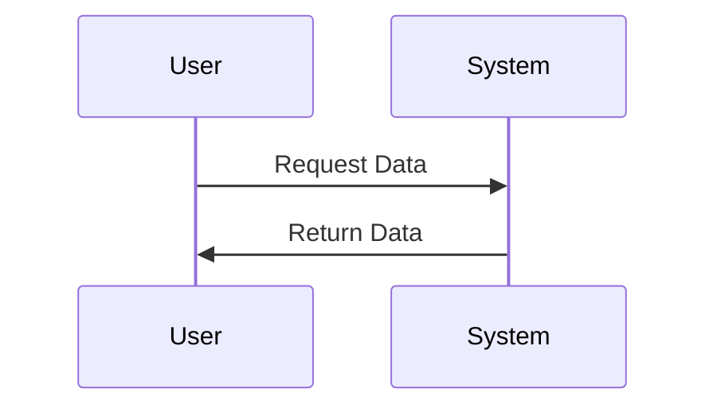

# Project Name

## Table of Contents
- [Overview](#overview)
- [Installation](#installation)
- [Usage](#usage)
- [Features](#features)
- [Contributing](#contributing)
- [License](#license)

## Overview
Lorem ipsum dolor sit amet, consectetur adipiscing elit. *Phasellus* nec **semper** tortor. ***Praesent*** ut commodo ante, vel dignissim mi. 

> Cras faucibus libero sit amet dui elementum, in semper erat porttitor. Nulla facilisi.
> 
> Fusce dignissim sed erat eget ultrices. Nam est magna, vehicula vel enim eget, volutpat finibus diam.

## Installation

### Prerequisites
* Item 1
* Item 2

### Step-by-Step Guide
1. First step with `inline code`
2. Second step

```bash
# Code block example
npm install 
npm start
```

## Usage

Here's how to use the project:

You can also reference specific [documentation](#overview).

## Features

| Feature | Description | Status |
|---------|-------------|--------|
| Feature 1 | Lorem ipsum dolor sit amet | ✅ |
| Feature 2 | Consectetur adipiscing elit | 🚧 |
| Feature 3 | Phasellus nec semper tortor | ❌ |

### Sub-Features

Nested lists:
- Main item 1
  - Sub item 1.1
  - Sub item 1.2
    - Sub-sub item 1.2.1

## Contributing

We welcome contributions! Please follow these steps:

~~This text is crossed out and not relevant anymore.~~

Guidelines:
- Fork the repository
- Create a feature branch
- Submit a pull request

### Code of Conduct

<details>
<summary>Click to expand Code of Conduct</summary>

Lorem ipsum dolor sit amet, consectetur adipiscing elit. Phasellus nec semper tortor. Praesent ut commodo ante, vel dignissim mi. Cras faucibus libero sit amet dui elementum, in semper erat porttitor. Nulla facilisi. Fusce dignissim sed erat eget ultrices.

</details>

## Diagrams

Sequence diagram:



## Definitions

Term 1
: Definition of term 1

## Task Lists

- [x] Completed task
- [ ] Incomplete task

## Horizontal Rule

---

## License

This project is licensed under the [MIT License](https://opensource.org/licenses/MIT).

---

<center>© 2025 Project Name. All rights reserved.</center>

---

*This README template was generated with the assistance of Claude AI by Anthropic.*

